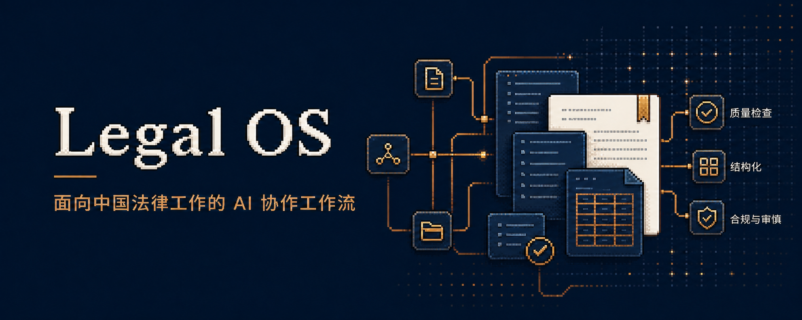

<p align="center">
  
</p>

# Legal OS

Legal OS 是一个面向中国法务工作场景、以 AI Agent 协作为入口的开源法律工作流框架。

## 最新公开更新

> **2026-07-24 · v0.4.0 公开预发布版**

- 为统一入口增加固定、可机读的路由输出契约；
- 增加稳定 route/blocker 代码、G3 状态优先级和 R0-R3 风险提问阶梯；
- 新增 `cn-case-hub`，通过免费官方来源检索、核验和分级整理中国大陆司法案例；
- 保留 v0.3.0 的跨工作流质量门和确定性发布锁；
- 提供 12 个可安装 Skill、24 个去身份化 Office 模板、15 个合成路由场景和 43 项自动化测试。

**下载：** 请从 [GitHub Releases](https://github.com/384363367-dot/legal-os/releases/tag/v0.4.0) 获取源码或一键安装包 `LegalOS-Skills-v0.4.0.zip`。

## 项目简介

它不是单纯的提示词集合，也不是替代律师判断的自动化系统，而是把法律事项从受理、分流、材料整理、事实与法律核验、起草审查，到质量控制、版本管理和成果交付，组织成一套可复用、可追溯、可持续迭代的工作方法。

## 核心亮点

- **统一受理与风险分流**：围绕事项类型、风险等级、授权状态、材料完整性、目标受众和交付要求，选择合适的工作路径；在权限不清、事实冲突、材料不足或需要外部行动时暂停复核。
- **最小上下文加载**：按任务只加载必要的规则、材料和工作模块，减少无关信息混入，降低隐私暴露、事实错配和不必要推理的风险。
- **模块化法律工作空间**：覆盖合同审查与修订、诉讼与仲裁、证据整理、正式函件、商业沟通、金额与数据核验、文件交付、汇报展示、事项记忆和统一受理分流等场景。
- **来源锁定与可核验工作流**：要求事实、金额、日期、法律命题和输出结论尽可能回到明确来源；无法核验、存在冲突或当前法律状态不明时，保留待核验状态，不用旧记忆或推测填补空白。
- **事实—证据—法律—请求/抗辩对齐**：把材料事实、证据支持、法律依据、程序位置和最终请求放在同一质量检查链条中；诉状、申请书和答辩状与独立证据目录成对生成，便于发现缺口、矛盾和越权结论。
- **可审查的合同与文档交付**：支持最小颗粒度合同修订规则、真实 DOCX 修订痕迹、清洁版与修订版区分，以及文件清单、质量闸门和交付验证。
- **哈希绑定的模板运行时**：正式文书先按文书类型和组织范围解析经批准模板；模板固定版式与最低内容骨架，但不限制依据当次事实、证据和法律风险扩展正文。
- **质量闸门与版本治理**：通过测试、依赖检查、隐私和秘密扫描、来源核验、版本记录和发布前检查，避免把未经审查的草稿直接当成正式成果。
- **面向 AI 协作而非盲目自动化**：把 AI 放在受控的受理、整理、核验、起草和复核流程中，保留人工判断、授权、签发、发送、提交和签署等关键控制点。

## 适用对象

Legal OS 适合作为律师、法务团队和法律 AI 工具开发者搭建可复用法律工作流的基础框架。

仓库中的内容是通用流程、规则结构、脚本和质量控制参考，不构成法律意见，也不替代具体事项中的专业判断、现行法核验、证据审查和授权审批。

## 当前公开范围

当前 v0.4.0 公开预发布版包含：

- 12 个可安装的 Legal OS Skills 及其工作流参考；
- 24 个去身份化 Office 模板、模板注册表、成对模板解析器和版式审计脚本；
- `legalos.manifest.json` 机器可读 Kernel 清单及 Schema；
- 工作空间和任务分流文档；
- `route-only` / `route-and-run`、固定路由输出契约、风险提问阶梯及 15 个合成场景测试；
- 免费官方来源案例检索、案例记录校验和类案报告规范；
- 合同修订质量闸门与指标脚本；
- 文档、脚本与合成安全测试指引。

证据映射仍是诉讼工作流阶段；案例检索由 `cn-case-hub` 提供，法规、规章、司法解释和具体法条仍依赖外部权威现行法检索能力。机器可读清单见 [`legalos.manifest.json`](legalos.manifest.json)，完整说明见 [`docs/capability-matrix.md`](docs/capability-matrix.md)。

## 快速开始

### 1. 获取并检查仓库

```bash
git clone https://github.com/384363367-dot/legal-os.git
cd legal-os
python -m venv .venv
source .venv/bin/activate
python -m pip install -r requirements.txt
python scripts/validate_repo.py
python scripts/validate_routing_scenarios.py
python -m unittest discover -s tests -v
```

### 2. 安装需要的 Skill

将 `skills/` 下需要的完整目录复制到 `$CODEX_HOME/skills/`，然后重新启动 Codex。建议先安装 `legal-os-unified-intake`、`legal-os-template-runtime` 和 `legal-quality-gate`，再按 [`docs/capability-matrix.md`](docs/capability-matrix.md) 选择业务 Skill。模板选择与审计规则见 [`docs/template-runtime.md`](docs/template-runtime.md)。

### 3. 开始使用

先阅读 [`docs/architecture.md`](docs/architecture.md)，再阅读目标 Skill 或工作空间文档。示例：

```text
使用 $legal-os-unified-intake 对这个法律事项进行受理、风险分级和工作流分流。
```

每个模块都应结合实际适用法域、证据来源、权限边界和质量要求进行审查与调整。

## 法律与安全声明

本仓库提供工作流结构、提示词、脚本和验证指引，不构成法律意见，也不替代专业判断。使用或发布相关成果前，请核验现行法律、权威来源、事实、权限和输出质量。

## 项目状态

当前公开预发布版本为 v0.4.0。在首个稳定版本发布前，接口、模块边界和仓库结构仍可能调整。版本变更见 [`CHANGELOG.md`](CHANGELOG.md)。

## 许可证

除文件或子目录另有说明外，本仓库采用 Apache License 2.0 许可。详见 [`LICENSE`](LICENSE)。如后续加入第三方材料，仍应遵守其各自的许可证和署名要求。
