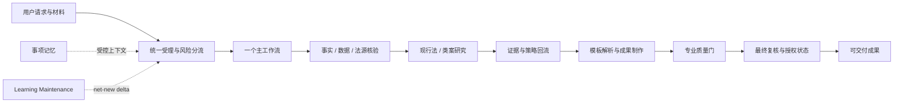

<p align="center">
  
</p>

<h1 align="center">Legal OS</h1>

<p align="center">
  <strong>面向中国法律工作场景的可安装、可组合、可审计 AI 工作流系统</strong>
</p>

<p align="center">
  把事项受理、合同、诉讼、现行法与类案研究、文书、数据、交付和质量控制，组织成一套可复用的法律工作基础设施。
</p>

<p align="center">
  
  
  <a href="LICENSE"></a>
</p>

<p align="center">
  <a href="docs/architecture.md">查看架构</a> ·
  <a href="docs/capability-matrix.md">能力矩阵</a> ·
  <a href="docs/case-and-law-research-v0.7.md">v0.7.0 研究架构</a> ·
  <a href="CHANGELOG.md">版本记录</a>
</p>

---

## 当前状态

**v0.7.0 是 Release Candidate，不是已发布稳定版。** 本包用于上传 GitHub、运行 GitHub Actions 并进行最终发布核验。`legalos.manifest.json` 的 `release_status` 保持 `candidate`；只有实际上传后的 CI 与人工发布检查通过，才应改为 `released` 并创建正式 Tag/Release。

当前包包含 **14 个 Skills** 和 **24 个去身份化 Office 模板**。

## 它解决什么问题

通用 AI 可以生成文字，但正式法律工作需要的不只是“写一段看起来正确的内容”。Legal OS 把材料来源、代表立场、事实与证据、现行法律、类案、金额日期、模板版本、文档质量、授权状态和最终交付放进同一条可审计工作流。

它不是一组零散提示词，也不是替代律师判断的无人值守系统。核心原则是：**先分流，再加载；先核验，再引用；事实—证据—法律—请求/抗辩保持可追溯；关键外部动作始终保留人工控制。**

## v0.7.0 核心升级

### 1. `cn-case-hub` 第一方类案研究引擎

保留原 Skill 名称和 v0.6 记录兼容性，但升级为：

- 新案 / 存量案件双入口；
- 最新案件状态锁定；
- 争点层、事实层、裁判依据层检索；
- 多轮法院语言校准；
- 程序链核验；
- `A/B/C/D × +/±/0/-` 双轴类案矩阵；
- `A-` 高相关不利案例强制处理；
- 裁判分叉变量；
- 类案结果反推证据缺口；
- 只允许使用“检索样本支持比例”，不得把检索样本包装成“胜诉率”。

### 2. 新增第一方 `cn-law-hub`

用于法律、行政法规、司法解释、规章等的：

- 权威来源核验；
- 法源效力；
- 修改/废止/版本链；
- 条文定位；
- 事实发生时与程序进行时的时间适用。

本包**不携带后来本地运行时中出现的第三方法规 crawler 实现**，也不要求另装第三方 Skill、MCP 或商业数据库 SDK。

### 3. `legal-os-litigation` 研究结果回流

类案与法源研究不再只用于“引用”。v0.7.0 要求：

`裁判分叉变量 → 本案事实 → 支持/不利证据 → evidence_gap → 对方攻击点 → 补证动作 → 论证/程序动作`

### 4. T-05 研究路由内置化

- `current-law-research` → `cn-law-hub`
- `case-research` → `cn-case-hub`

当研究只是诉讼或合同事项的辅助任务时，原 substantive workflow 继续保持唯一 primary route。

### 5. `legal-os-learning-maintenance` 正式纳入公开 Skill 清单

T-12 由该 Skill 负责可复用错误、规则优化与周期维护，遵循 **net-new-only**：已有规则不重复沉淀，事项事实不污染全局规则。

### 6. 发布工程与安全治理修复

- 保留 GitHub 原有严格 manifest/schema/validator；
- 保留 `execution_modes`、完整 `invocation_policy` 和 `template_runtime`；
- 恢复安全 `.gitignore`：默认排除真实 DOCX/PDF/XLSX、`private/`、`confidential/`、`client-materials/`、`matter-files/`；
- 恢复全部 24 个模板注册和 SHA-256 绑定；
- 保留历史 CHANGELOG、原架构文档和旧回归门，不以“降低测试标准”换取通过；
- 新增第一方研究边界和安装测试。

完整差异见 [`UPGRADE_REPORT_v0.7.0.md`](UPGRADE_REPORT_v0.7.0.md)。

## 系统如何工作


```mermaid
flowchart LR
    A["用户请求与材料"] --> B["统一受理与风险分流"]
    B --> C["一个主工作流"]
    C --> D["事实 / 数据 / 法源核验"]
    D --> E["现行法 / 类案研究"]
    E --> F["证据与策略回流"]
    F --> G["模板解析与成果制作"]
    G --> H["专业质量门"]
    H --> I["最终复核与授权状态"]
    I --> J["可交付成果"]

    K["事项记忆"] -. 受控上下文 .-> B
    L["Learning Maintenance"] -. net-new delta .-> B
```

系统入口为 `legal-os-unified-intake`。它识别事项类型、代表角色、风险、材料缺口、输出对象和授权边界，选择一个主工作流，并只组合必要辅助模块。

## 14 个可安装 Skills

| Skill | 角色 | 主要能力 |
|---|---|---|
| [`legal-os-unified-intake`](skills/legal-os-unified-intake/) | Router | 统一受理、风险/缺口识别、一个 primary route + 必要 auxiliaries |
| [`legal-os-contract`](skills/legal-os-contract/) | Primary | 合同审核、最小必要修改、tracked-changes DOCX 与质量门 |
| [`legal-os-litigation`](skills/legal-os-litigation/) | Primary | 诉讼/仲裁分析、证据映射、研究回流、诉辩文书与证据目录 |
| [`cn-case-hub`](skills/cn-case-hub/) | Primary/Auxiliary | 官方案例核验、双轴类案矩阵、程序链、裁判分叉变量 |
| [`cn-law-hub`](skills/cn-law-hub/) | Primary/Auxiliary | 现行法、版本、效力、条文、时间适用核验 |
| [`legal-os-correspondence`](skills/legal-os-correspondence/) | Primary | 律师函、催款/履约通知、回复函、情况说明 |
| [`legal-os-business-communication`](skills/legal-os-business-communication/) | Primary | 微信、邮件、会议/电话口径与承诺风险控制 |
| [`legal-os-data-verification`](skills/legal-os-data-verification/) | Primary/Auxiliary | 金额、付款、发票、日期节点、数据冲突 |
| [`legal-os-file-delivery`](skills/legal-os-file-delivery/) | Primary/Auxiliary | 文件转换、打包、版本、归档、交付检查 |
| [`legal-os-reporting-presentation`](skills/legal-os-reporting-presentation/) | Primary | 周报/月报、领导汇报、客户报告、PPT 结构 |
| [`legal-os-matter-memory`](skills/legal-os-matter-memory/) | Primary/Auxiliary | 事项记忆、动态事实状态、可复用与事项信息分层 |
| [`legal-os-template-runtime`](skills/legal-os-template-runtime/) | Cross-cutting | 24 个模板解析、SHA-256 绑定、缺模板/哈希失败停止 |
| [`legal-quality-gate`](skills/legal-quality-gate/) | Cross-cutting | 正式法律成果最终复核与 release lock |
| [`legal-os-learning-maintenance`](skills/legal-os-learning-maintenance/) | Governance | 周期复盘、Critical hotfix、net-new-only 规则升级 |

更完整的路由边界见 [`docs/capability-matrix.md`](docs/capability-matrix.md)。

## 快速开始

### 从仓库根目录安装 Skills

```bash
./install.sh --dry-run
./install.sh
```

默认安装到 `~/.codex/skills`。安装脚本不会静默覆盖已有 Skill；如需替换：

```bash
./install.sh --replace
```

旧 Skill 会先备份。可选创建/更新 Python runtime：

```bash
./install.sh --setup-runtime
```

此选项只读取仓库根 `requirements.txt`；不依赖本地快照中的 `runtime/` 目录。

### 从源码选择安装

也可只复制 `skills/` 下所需的完整目录。不要只复制 `SKILL.md`，因为 references、scripts、templates 和 `agents/openai.yaml` 都是 Skill 的组成部分。

## 使用示例

```text
使用 $legal-os-unified-intake 读取材料，判断事项类型、风险、缺口和下一步工作流。
```

```text
使用 $cn-case-hub 针对这个争点查正反类案，按 A/B/C/D × +/±/0/- 分类，并提炼可能改变裁判结果的事实变量。
```

```text
使用 $cn-law-hub 核验这条规定当前是否有效、历史版本、适用时间以及准确条文。
```

```text
使用 $legal-os-litigation 把已核验案例和法源结果映射到本案证据缺口、补证动作和诉讼策略。
```

## 法律与研究边界

- 本项目不构成法律意见，不替代律师、法务或其他专业人员判断；
- 事实、证据、金额、日期、案件状态和现行法律必须根据具体事项重新核验；
- 搜索摘要、模型记忆和二手材料只能作为线索；
- 外部官方站点的登录、验证码、robots 或权限限制不得绕过；
- “第一方 Skill”是指工作流/脚本由本仓库维护，不意味着 Legal OS 自行拥有一套完整法规/裁判数据库；
- 起草不等于发送，完成不等于签署，内部审查不等于提交；外部动作需要独立授权。

## 发布前验证

本候选包包含：

```bash
python scripts/validate_repo.py
python scripts/validate_routing_scenarios.py
python -m unittest discover -s tests -v
python skills/cn-case-hub/scripts/check_first_party_boundary.py
python skills/cn-law-hub/scripts/check_first_party_boundary.py
./install.sh --dry-run
```

实际本地测试结果见 [`TEST_REPORT_v0.7.0.md`](TEST_REPORT_v0.7.0.md)。GitHub Actions 只有在本包上传到 GitHub 后才能形成最终远端 CI 证据。

## 文档导航

- [系统架构](docs/architecture.md)
- [能力矩阵](docs/capability-matrix.md)
- [统一入口与路由](docs/unified-intake-routing.md)
- [v0.7.0 案例/现行法研究架构](docs/case-and-law-research-v0.7.md)
- [诉讼工作空间](docs/litigation-workspace.md)
- [证据工作空间](docs/evidence-workspace.md)
- [模板运行时](docs/template-runtime.md)
- [Office 质量门](docs/native-office-quality-gate.md)
- [版本记录](CHANGELOG.md)
- [贡献指南](CONTRIBUTING.md)

## 项目状态与许可证

当前候选版本为 **v0.7.0 RC**。上一已发布公开预发布版本为 v0.6.2。稳定版本发布前，接口和模块边界仍可能调整。

除文件或子目录另有说明外，本仓库采用 [Apache License 2.0](LICENSE) 许可。
