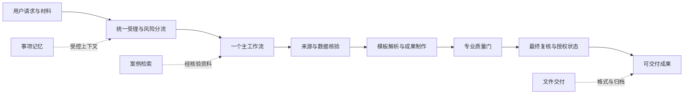

<p align="center">
  
</p>

<h1 align="center">Legal OS</h1>

<p align="center">
  <strong>面向中国法律工作场景的可安装、可组合、可审计 AI 工作流系统</strong>
</p>

<p align="center">
  把事项受理、合同、诉讼、案例检索、文书、数据、交付和质量控制，组织成一套可复用的法律工作基础设施。
</p>

<p align="center">
  <a href="https://github.com/384363367-dot/legal-os/releases/tag/v0.6.0"></a>
  
  <a href="LICENSE"></a>
</p>

<p align="center">
  <a href="https://github.com/384363367-dot/legal-os/releases/tag/v0.6.0"><strong>下载现行公开预发布包</strong></a>
  ·
  <a href="docs/architecture.md">查看架构</a>
  ·
  <a href="docs/capability-matrix.md">能力矩阵</a>
  ·
  <a href="CHANGELOG.md">版本记录</a>
</p>

---

## 它解决什么问题

通用 AI 可以生成文字，但正式法律工作需要的不只是“写一段看起来正确的内容”。Legal OS 把法律工作的关键约束放进同一条工作流：材料来源、代表立场、事实与证据、现行法律、金额日期、模板版本、文档质量、授权状态和最终交付。

它不是一组零散提示词，也不是替代律师判断的无人值守系统。它更像一套运行在 AI Agent 上的法律工作操作层：先分流，再调用专业模块；先核验，再生成；每一个正式成果都经过对应的质量门。

| 当前公开版 | 可安装法律 Skills | 去身份化法律 Office 模板 |
|---:|---:|---:|
| **v0.6.0 公开预发布版** | **12** | **24** |

> **当前公开预发布：2026-08-10 · v0.6.0。** 本版本改进合同 DOCX 结构质量门、极简批注校验和标准段落标记修订识别；完整变化见 [CHANGELOG](CHANGELOG.md)。

## 为什么是 Legal OS

- **工作流，而不只是提示词**：从受理、分流、核验、起草、复核到交付形成连续链条，减少在多个聊天和工具之间丢失上下文。
- **来源锁定**：事实、金额、日期和法律命题必须回到当次材料或实际访问的权威来源；缺失、冲突和无法核验的内容保持待核验状态。
- **事实—证据—法律—请求对齐**：诉讼分析、证据映射、法律研究和文书请求使用同一检查链，便于发现证据缺口和论证跳跃。
- **精确模板与可审查文档**：模板按文种和适用范围解析并进行 SHA-256 完整性检查；合同修订、正式函件和诉讼文书保留对应的文档质量控制。
- **最小必要上下文**：统一入口只加载当前事项需要的专业模块，降低无关规则混入、事实错配和敏感信息扩散的风险。
- **关键动作保留人工控制**：起草不等于发送，完成不等于签署，内部审查不等于提交；外部行动和高影响决定始终是独立授权状态。
- **法律成果分层**：区分工作底稿、内部分析、修订稿、清洁版和最终成果，避免把内部策略、未经核验内容或过程信息带入对外文件。

## 系统如何工作


```mermaid
flowchart LR
    A["用户请求与材料"] --> B["统一受理与风险分流"]
    B --> C["一个主工作流"]
    C --> D["来源与数据核验"]
    D --> E["模板解析与成果制作"]
    E --> F["专业质量门"]
    F --> G["最终复核与授权状态"]
    G --> H["可交付成果"]

    I["事项记忆"] -. 受控上下文 .-> B
    J["案例检索"] -. 经核验资料 .-> C
    K["文件交付"] -. 格式与归档 .-> H
```

系统入口为 `legal-os-unified-intake`。它识别事项类型、代表角色、风险、材料缺口、输出对象和授权边界，然后选择一个主工作流，并只组合必要的辅助模块。

## 12 个可安装 Skills

### 入口与核心法律工作

| Skill | 适用场景 | 主要能力 |
|---|---|---|
| [`legal-os-unified-intake`](skills/legal-os-unified-intake/) | 事项类型不清、任务混合、材料冲突或风险较高 | 读取请求和材料，识别角色、目标、风险与缺口，选择一个主工作流并控制追问数量 |
| [`legal-os-contract`](skills/legal-os-contract/) | 合同审核、风险扫描、甲乙方立场、DOCX 修订 | 最小颗粒度修改、修订版与清洁版控制、履约风险检查、修订结构指标和质量门 |
| [`legal-os-litigation`](skills/legal-os-litigation/) | 民事诉讼、商事仲裁、劳动仲裁、证据整理 | 诉讼分析、事实—证据映射、法律研究、诉状/申请书/答辩书与独立证据目录成对制作 |
| [`cn-case-hub`](skills/cn-case-hub/) | 中国大陆案例、类案、裁判观点和案号核验 | 仅使用实际访问的免费官方来源，生成正反向检索式、核验案例记录并形成可追溯类案材料 |

### 文书、沟通与数据

| Skill | 适用场景 | 主要能力 |
|---|---|---|
| [`legal-os-correspondence`](skills/legal-os-correspondence/) | 律师函、催款函、履约通知、回复函、情况说明 | 建立事实与期限台账，区分可确认事实和待核验内容，控制责任表述、权利保留和发送状态 |
| [`legal-os-business-communication`](skills/legal-os-business-communication/) | 商务微信、邮件、电话或会议口径、项目协调 | 在简洁表达中控制事实准确性、承诺风险、附件、期限和内外部边界 |
| [`legal-os-data-verification`](skills/legal-os-data-verification/) | 金额、付款、发票、日期节点和数据冲突 | 分离来源值、派生计算与人工结论，形成可追溯核验台账并标记缺失证据 |
| [`legal-os-reporting-presentation`](skills/legal-os-reporting-presentation/) | 周报月报、领导汇报、客户报告、RAG 状态、PPT | 从来源材料生成结构化报告或演示方案，区分事实、判断、风险、依赖和待决策事项 |

### 交付、记忆与质量控制

| Skill | 适用场景 | 主要能力 |
|---|---|---|
| [`legal-os-file-delivery`](skills/legal-os-file-delivery/) | Word/PDF/表格/图片转换、合并、拆分、提交包和归档 | 文件清单、版本关系、脱敏、命名、哈希、打包、打印和最终交付检查 |
| [`legal-os-matter-memory`](skills/legal-os-matter-memory/) | 保存项目背景、整理事项线索、清理记忆、沉淀重复流程 | 按规则、Skill/模板、事项线索和动态事实分层，保留来源、日期、状态和最小必要信息 |
| [`legal-os-template-runtime`](skills/legal-os-template-runtime/) | 任何需要正式模板的法律成果 | 精确匹配文种，按优先级解析模板，校验 SHA-256，保持固定版式外壳并允许正文按事项展开 |
| [`legal-quality-gate`](skills/legal-quality-gate/) | 正式或高风险法律成果的最终复核 | 检查事实、证据、现行法、法律关系、请求或抗辩、责任表述、模板和最终成果授权状态 |

更完整的路由关系和能力边界见 [`docs/capability-matrix.md`](docs/capability-matrix.md)。

## 法律工作控制

| 常见风险 | Legal OS 的处理方式 |
|---|---|
| 材料缺失或事实冲突 | 停止补造，保留 `待核验` 或阻塞状态 |
| 法条、案例或效力状态不明 | 要求权威来源核验，模型记忆不能作为正式引用 |
| 使用了错误或未经批准的模板 | 模板运行时拒绝继续，不用相近模板静默替代 |
| 诉状与证据目录不一致 | 成对生成并检查证据编号、名称、证明目的和正文事实结构 |
| 原告首次文书暴露对方抗辩路线 | 保持单方主张链；推测性抗辩和完整应对策略留在内部分析 |
| 草稿被误当成正式成果 | 区分草稿、内部复核、清洁版、最终版和外部动作授权 |

## 快速开始

### 方式一：安装现行公开预发布包（推荐）

从 [v0.6.0 Releases 页面](https://github.com/384363367-dot/legal-os/releases/tag/v0.6.0) 下载：

- `LegalOS-Skills-v0.6.0.zip`
- `LegalOS-Skills-v0.6.0.zip.sha256`

在下载目录先核验 ZIP，再解压并进入安装包目录：

```bash
shasum -a 256 -c LegalOS-Skills-v0.6.0.zip.sha256
unzip LegalOS-Skills-v0.6.0.zip
cd LegalOS-Skills-v0.6.0
./install.sh --dry-run
./install.sh
```

默认安装到 Codex Skills 目录。安装脚本不会静默覆盖已有 Skill；需要替换时必须显式使用 `--replace`，旧目录会先备份。

### 方式二：从源码选择安装

将 `skills/` 下所需的完整目录复制到 Codex Skills 目录，然后重新启动 Codex。建议从以下组合开始：

1. `legal-os-unified-intake`：统一入口和分流；
2. `legal-os-template-runtime`：模板解析与完整性控制；
3. `legal-quality-gate`：正式成果最终复核；
4. 一个与实际任务对应的主工作流。

不要只复制 `SKILL.md`；模板、references、脚本和 Agent 元数据也是 Skill 的组成部分。

## 使用示例

```text
使用 $legal-os-unified-intake 读取这些材料，判断事项类型、风险、缺口和下一步工作流。
```

```text
使用 $legal-os-contract 从乙方立场审核这份 DOCX，输出风险清单、修订版和清洁版，并运行修订质量门。
```

```text
使用 $legal-os-litigation 整理事实、证据和法律问题，形成内部分析、起诉状草稿及配套证据目录。
```

```text
使用 $cn-case-hub 检索支持和反对该争点的中国大陆官方案例，并核验案号、来源和裁判观点。
```

## 法律使用边界

- 本项目不构成法律意见，不替代律师、法务或其他专业人员的判断；
- 事实、证据、金额、日期和现行法律必须根据具体事项重新核验；
- `cn-case-hub` 处理官方案例检索；法规、规章、司法解释和具体法条需要另行使用可核验的权威现行法检索能力；
- Skills 不会自动取得发送、签署、提交、立案、发布或联系第三方的权限；
- 任何正式成果都应结合具体法域、程序阶段、代表立场、证据情况和适用期限进行专业复核。

## 文档导航

- [系统架构](docs/architecture.md)
- [能力矩阵](docs/capability-matrix.md)
- [统一入口与路由](docs/unified-intake-routing.md)
- [模板运行时](docs/template-runtime.md)
- [诉讼工作空间](docs/litigation-workspace.md)
- [原告/申请人文书工作空间](docs/pleading-workspace.md)
- [Office 质量门](docs/native-office-quality-gate.md)
- [版本记录](CHANGELOG.md)
- [贡献指南](CONTRIBUTING.md)

## 项目状态与许可证

当前公开版本为 **v0.6.0 公开预发布版**。在稳定版本发布前，接口、模块边界和仓库结构仍可能调整。

除文件或子目录另有说明外，本仓库采用 [Apache License 2.0](LICENSE) 许可。
